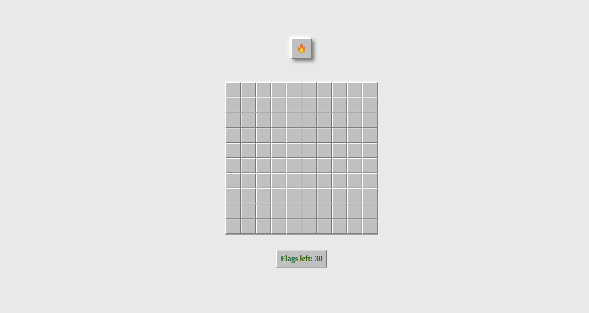
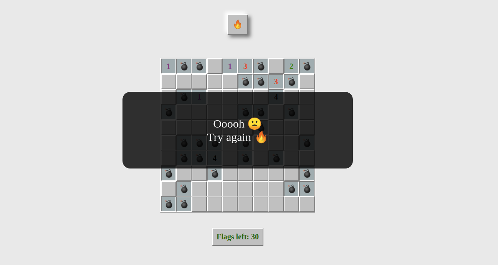
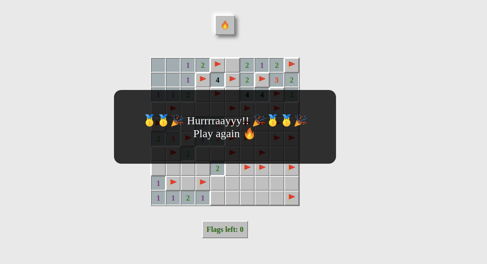

# JS Minesweeper 
This repository contains the source code for minsweeper game built using Javascript.

Click on this emoticon [ :heart_eyes:  ](https://ashky23.github.io/minesweeper-JS/) to play

> `1.`  start 

> `2.` Lost

> `3.` Won
